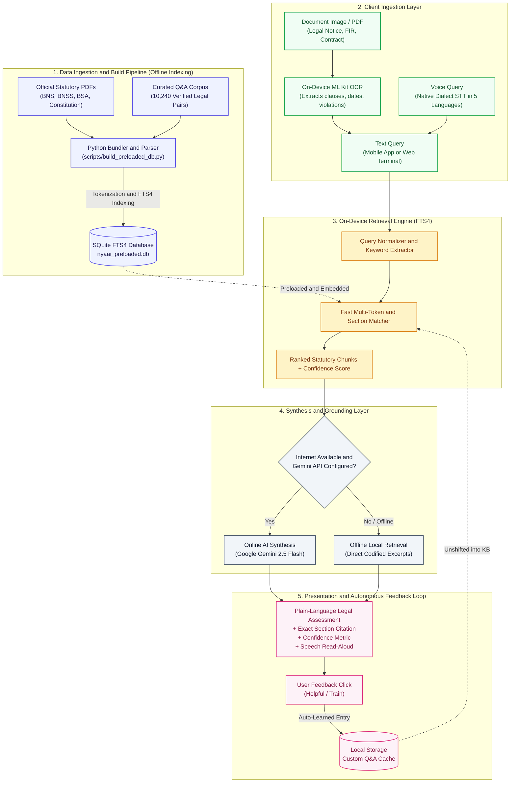

# Nyaai (न्यायAI) — Data Architecture & Workflow

This document details the end-to-end data pipeline of Nyaai, explaining how legal documents are indexed, how user queries are processed across online and offline states, and how on-device retrieval and self-training work.

---

## 1. Complete Workflow Diagram

---

## 2. Pipeline Breakdown

### Stage 1: Data Ingestion and Offline Indexing
- Source documents: Constitution of India, Bharatiya Nyaya Sanhita (BNS 2023), Bharatiya Nagarik Suraksha Sanhita (BNSS 2023), and Bharatiya Sakshya Adhiniyam (BSA 2023).
- Data is parsed, stripped of stopwords, tokenized, and indexed into SQLite with FTS4 full-text search capability.
- Bundled directly inside the Android APK (under `app/src/main/assets/database/nyaai_preloaded.db`) and web client for instant offline cold starts.

### Stage 2: Client Ingestion Layer
- Text Queries: Typed directly in the mobile app or web terminal.
- Voice Search: Speech-to-Text with Indian dialect acoustic routing (`en-IN`, `hi-IN`, `bn-IN`, `te-IN`, `ta-IN`).
- Document Vision: Google ML Kit OCR and Android PDFBox parse legal notices, contracts, and FIR copies on-device with zero cloud leakage.

### Stage 3: On-Device Retrieval Engine (FTS4)
- Multi-token scoring and section regex detection (e.g., Section 482, Article 21, Section 103).
- BM25/FTS4 scoring across 1,838 indexed sections and 10,240 verified Q&As.
- Calculates confidence score based on keyword relevance and exact section matches.

### Stage 4: Synthesis and Grounding Layer
- Online Mode: Pipes the retrieved statutory citations as strict context to Google Gemini 2.5 Flash, generating a plain-language summary and actionable next steps.
- Offline Mode: If network is unavailable or API key is absent, immediately displays the exact verified statutory provisions directly from local storage.

### Stage 5: Autonomous Feedback Loop
- User feedback (Helpful / Train) triggers on-device caching in local storage (`nyaai_user_learned_qa`).
- The learned Q&A entry is unshifted into the active knowledge base for instantaneous recall on subsequent queries.
