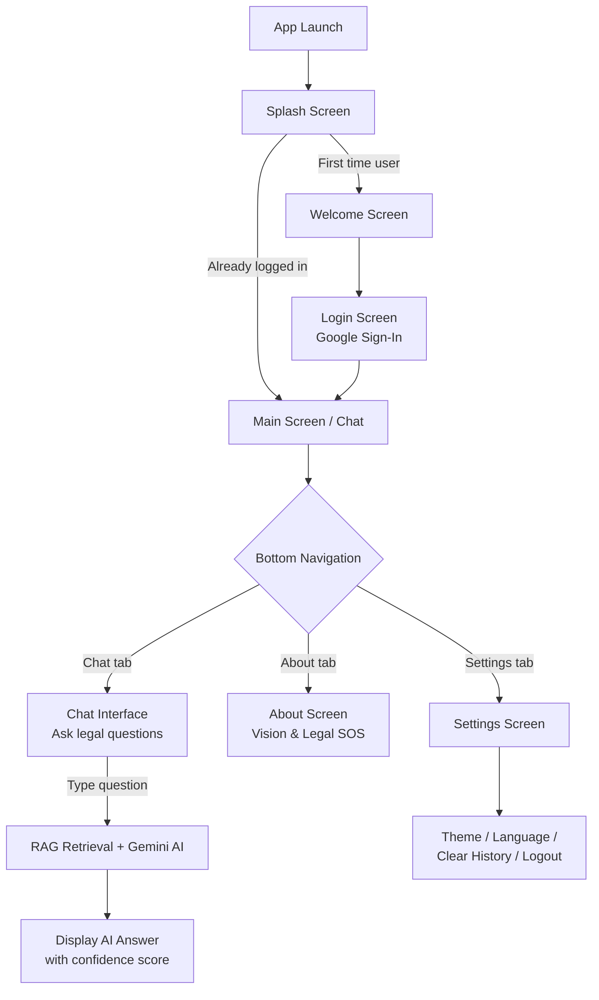

# 📋 NYAAI — Project Handover Document

> **Project:** Nyaai — AI-Powered Indian Legal Assistant  
> **Platform:** Android (Native — Kotlin + Jetpack Compose)  
> **Date:** May 2026

---

## 📌 What is Nyaai?

Nyaai is an **AI-powered legal assistant** Android app that helps everyday Indian citizens understand their legal rights in **simple language**. It uses:

- **On-device RAG (Retrieval Augmented Generation)** — Extracts and indexes legal PDFs (Constitution of India, BNS, BNSS, BSA) into a local SQLite/Room FTS4 database
- **Google Gemini API** (`gemini-2.5-flash`) — Generates human-friendly answers grounded in retrieved legal context
- **Multi-language support** — English, Hindi, Bengali, Telugu, Tamil
- **Firebase Authentication** — Google Sign-In for user accounts
- **Chat History** — Persistent chat sessions stored locally via Room DB

---

## 🛠️ Prerequisites (What You Need Installed)

| Tool | Version | Download |
|------|---------|----------|
| **Android Studio** | Latest stable (Ladybug+) | [developer.android.com](https://developer.android.com/studio) |
| **JDK** | 17 (bundled with Android Studio) | Included in Android Studio JBR |
| **Android SDK** | API 34 (compileSdk) | Via Android Studio SDK Manager |
| **Kotlin** | 1.9.22 | Bundled via Gradle plugin |
| **Internet** | Required | For Gemini API calls & Firebase Auth |

> [!IMPORTANT]  
> **No Python backend is needed to run the app.** The app works standalone — all RAG retrieval and AI generation happen via on-device Room DB + remote Gemini API calls. The `backend/` folder contains an optional Python RAG server (not required for the Android app to function).

---

## 🚀 How to Open & Run the Project

### Step 1: Open in Android Studio

1. Launch **Android Studio**
2. Click **File → Open**
3. Navigate to the project folder: `nyaai_app testing/`
4. Select the root folder (the one containing `settings.gradle.kts`) and click **OK**
5. Wait for Gradle sync to complete (may take 2-5 minutes on first load)

### Step 2: Fix `local.properties` (If Needed)

The file `local.properties` contains the Android SDK path specific to the original developer's machine. If Gradle sync fails:

1. Open `local.properties` in the project root
2. Replace the `sdk.dir` value with **your** Android SDK path:
   ```properties
   sdk.dir=C\:\\Users\\YOUR_USERNAME\\AppData\\Local\\Android\\Sdk
   ```
   Or on macOS/Linux:
   ```properties
   sdk.dir=/Users/YOUR_USERNAME/Library/Android/sdk
   ```

### Step 3: Fix `gradle.properties` (If Needed)

The `gradle.properties` file points to a specific JDK location. If it fails:

1. Open `gradle.properties`
2. Either **remove** the `org.gradle.java.home` line, or update it to your Android Studio JBR path:
   ```properties
   org.gradle.java.home=C:\\Program Files\\Android\\Android Studio\\jbr
   ```

### Step 4: Run the App

1. Connect a **physical Android device** (USB debugging enabled) **OR** create an **AVD emulator** (API 26+)
2. Click the green **▶ Run** button in Android Studio
3. Select your target device
4. Wait for build & installation (~1-2 minutes first time)

> [!TIP]
> **First launch takes ~15-30 seconds** because the app extracts and indexes 4 legal PDF files into the Room database on first run. Subsequent launches are instant.

---

## 🔑 API Key Configuration

The app uses the **Google Gemini API** for AI-powered responses. Configure your API key in `local.properties`:

```properties
gemini.api.key=YOUR_API_KEY_HERE
```

Gradle injects this key directly into `BuildConfig.GEMINI_API_KEY` at build time.

> [!WARNING]
> Keep `local.properties` out of version control. For production, supply your own key from [Google AI Studio](https://aistudio.google.com/).

**If the API key is expired or rate-limited**, the app will automatically fall back to **offline mode** — showing direct excerpts from legal documents instead of AI-generated answers.

---

## 🏗️ Project Architecture

```
nyaai_app testing/
├── app/                          ← Main Android module
│   ├── build.gradle.kts          ← Dependencies & build config
│   ├── google-services.json      ← Firebase config
│   └── src/main/
│       ├── AndroidManifest.xml   ← App permissions & entry point
│       ├── assets/               ← Legal PDF files (bundled with app)
│       │   ├── coi.pdf           ← Constitution of India
│       │   ├── bns.pdf           ← Bharatiya Nyaya Sanhita (Criminal Law)
│       │   ├── bnss.pdf          ← Bharatiya Nagarik Suraksha Sanhita (Criminal Procedure)
│       │   └── bsa.pdf           ← Bharatiya Sakshya Adhiniyam (Evidence Act)
│       ├── java/com/nyaai/
│       │   ├── MainActivity.kt   ← App entry point (sets up everything)
│       │   ├── data/local/       ← Data layer (AI + Database)
│       │   ├── theme/            ← Material 3 theming
│       │   └── ui/               ← All UI code
│       └── res/                  ← Android resources (icons, etc.)
├── backend/                      ← (OPTIONAL) Python RAG server
├── assets/                       ← Project assets (icons, fonts, data)
├── scripts/                      ← Utility scripts (data generation)
├── build.gradle.kts              ← Root Gradle config (plugin versions)
├── settings.gradle.kts           ← Module declaration
├── gradle.properties             ← JVM & build settings
└── local.properties              ← SDK path (machine-specific)
```

---

## 📦 Package-by-Package Breakdown

### 1. `com.nyaai` — Root Package

| File | Purpose |
|------|---------|
| **`MainActivity.kt`** | The **single entry point** of the app. Initializes Firebase, Room database, PDF extractor, AI service, and sets up Jetpack Compose with all CompositionLocal providers (theme, language, auth state, etc.). |

### 2. `com.nyaai.data.local` — Data Layer

| File | Purpose |
|------|---------|
| **`RagDatabase.kt`** | Defines the **Room database** with 4 tables: `documents` (FTS4 full-text search), `chat_sessions`, `chat_messages`, and `training_examples`. Also defines the `RagDao` interface with all SQL queries. |
| **`PdfExtractorService.kt`** | On first launch, extracts text from the 4 legal PDFs in `assets/`, chunks them by Article/Section boundaries, cleans gazette headers, and inserts them into the Room FTS4 `documents` table. |
| **`AiService.kt`** | The **core AI engine**. Implements a RAG pipeline: (1) keyword-based FTS4 retrieval from Room DB → (2) confidence scoring → (3) Gemini API call with grounded prompt → (4) offline fallback if API fails. Includes retry logic with exponential backoff for rate limiting. |

### 3. `com.nyaai.ui.screens` — Screen Composables

| File | Purpose |
|------|---------|
| **`SplashScreen.kt`** | Brief loading screen shown on app launch. Routes to Home (if logged in) or Welcome (if first time). |
| **`WelcomeScreen.kt`** | Onboarding screen with app introduction. Navigates to Login. |
| **`LoginScreen.kt`** | Firebase Authentication with Google Sign-In. |
| **`MainScreen.kt`** | The **main hub** with bottom navigation (Chat, About, Settings). Contains the chat interface with suggested questions, chat input, and message display. |
| **`ChatScreen.kt`** | The detailed chat interface. Displays conversation messages, handles user input, calls `AiService.generateAnswer()`, shows AI responses with confidence indicators, and supports message feedback (Good/Average/Poor). |
| **`SettingsScreen.kt`** | Full settings page: Theme (Light/Dark/System), App Language, AI Response Language, Notifications toggle, Low Bandwidth Mode, Clear Chat History, Privacy Policy, Logout. |
| **`AboutScreen.kt`** | About page with the vision behind Nyaai, Legal SOS helplines, and team information. |

### 4. `com.nyaai.ui.navigation` — Navigation

| File | Purpose |
|------|---------|
| **`AppNavigation.kt`** | Defines all app routes (`SPLASH`, `WELCOME`, `LOGIN`, `HOME`, `ABOUT`, `SETTINGS`) and the Jetpack Compose Navigation graph with transitions. |

### 5. `com.nyaai.ui.state` — State Management

| File | Purpose |
|------|---------|
| **`AppState.kt`** | Defines `AppTheme` enum (Light/System/Dark), `AppLanguage` enum (English/Hindi/Bengali/Telugu/Tamil), and 13 `CompositionLocal` providers for sharing state across all Composables (theme, language, auth, AI service, notifications, etc.). |

### 6. `com.nyaai.ui.strings` — Internationalization (i18n)

| File | Purpose |
|------|---------|
| **`AppStrings.kt`** | Contains the `AppStrings` data class with all UI text, plus full translations for all 5 languages. The `stringsFor()` factory function returns the correct string set based on selected language. |

### 7. `com.nyaai.theme` — Material 3 Theme

| File | Purpose |
|------|---------|
| **`Theme.kt`** | Defines dark and light color schemes (navy/steel-blue palette) and the `NyaaiTheme` composable wrapper. |
| **`Type.kt`** | Typography definitions for the app. |

---

## ⚙️ How the RAG Pipeline Works (Step by Step)

```
┌─────────────────────────────────────────────────────────────────┐
│                     USER ASKS A QUESTION                        │
│              e.g. "What are my rights if arrested?"              │
└────────────────────────┬────────────────────────────────────────┘
                         ▼
┌─────────────────────────────────────────────────────────────────┐
│  STEP 1: KEYWORD EXTRACTION                                     │
│  • Strips special characters, filters words ≥ 3 chars           │
│  • Extracts numbers (for article/section references)            │
└────────────────────────┬────────────────────────────────────────┘
                         ▼
┌─────────────────────────────────────────────────────────────────┐
│  STEP 2: FTS4 RETRIEVAL (Room Database)                         │
│  • Phrase search → Number search → Wildcard search              │
│  • Searches across all 4 legal PDFs (COI, BNS, BNSS, BSA)      │
│  • Returns top 5 unique document chunks                         │
└────────────────────────┬────────────────────────────────────────┘
                         ▼
┌─────────────────────────────────────────────────────────────────┐
│  STEP 3: CONFIDENCE SCORING                                     │
│  • 3+ matches → 0.92  │  2 matches → 0.85                      │
│  • 1 match   → 0.70   │  0 matches → 0.40                      │
│  • Bonus +0.05 if article number found in results               │
└────────────────────────┬────────────────────────────────────────┘
                         ▼
┌─────────────────────────────────────────────────────────────────┐
│  STEP 4: GEMINI API CALL                                        │
│  • Model: gemini-2.5-flash                                      │
│  • Prompt includes: retrieved legal context + user question      │
│  • Instructions: "explain like talking to a friend"              │
│  • Auto-detects language, replies in same language               │
│  • 3 retries with 5s exponential backoff for rate limits         │
└────────────────────────┬────────────────────────────────────────┘
                         ▼
┌─────────────────────────────────────────────────────────────────┐
│  STEP 5: RESPONSE OR FALLBACK                                   │
│  • If API succeeds → AI-generated friendly legal answer         │
│  • If API fails → Offline fallback with direct document excerpts │
└─────────────────────────────────────────────────────────────────┘
```

---

## 📱 App Flow (User Journey)



---

## 🗂️ Key Dependencies

| Library | Version | Purpose |
|---------|---------|---------|
| Jetpack Compose | BOM 2023.10.01 | Modern declarative UI framework |
| Material 3 | Latest via BOM | Material Design 3 components |
| Navigation Compose | 2.7.6 | Screen-to-screen navigation |
| Room + FTS4 | 2.6.1 | Local SQLite database with full-text search |
| Firebase Auth | via BOM 32.7.1 | Google Sign-In authentication |
| Play Services Auth | 20.7.0 | Google account integration |
| PDFBox Android | 2.0.27.0 | Extract text from PDF files |
| Generative AI SDK | 0.9.0 | Google Gemini API client |
| Desugaring | 2.0.4 | Java 8+ API support on older Android |

---

## 🔥 Firebase Setup

The app uses Firebase for **Google Sign-In authentication only**. The config file is at:

```
app/google-services.json
```

> [!NOTE]
> If you need to use your own Firebase project, create one at [Firebase Console](https://console.firebase.google.com/), enable **Authentication → Google Sign-In**, download a new `google-services.json`, and replace the existing file.

---

## 📂 Legal PDFs (Bundled Data)

These PDFs are stored in `app/src/main/assets/` and are automatically extracted & indexed on first launch:

| File | Full Name | Content |
|------|-----------|---------|
| `coi.pdf` | Constitution of India | Fundamental rights, directive principles, articles |
| `bns.pdf` | Bharatiya Nyaya Sanhita | New criminal law (replaces IPC) |
| `bnss.pdf` | Bharatiya Nagarik Suraksha Sanhita | Criminal procedure (replaces CrPC) |
| `bsa.pdf` | Bharatiya Sakshya Adhiniyam | Evidence law (replaces Indian Evidence Act) |

---

## 🐛 Troubleshooting

| Problem | Solution |
|---------|----------|
| **Gradle sync fails** | Check `local.properties` SDK path and `gradle.properties` JDK path (see Steps 2 & 3 above) |
| **"API key invalid" or no AI responses** | The API key may be expired. Get a new one from [AI Studio](https://aistudio.google.com/) and update `MainActivity.kt` line 35 |
| **App crashes on first launch** | Ensure the device has enough storage (~50MB for PDF extraction). Check Logcat for `PdfExtractor` errors |
| **"Rate limited" (429 errors)** | The Gemini API has free-tier rate limits. Wait 60 seconds and retry, or upgrade the API plan |
| **Firebase login fails** | Verify `google-services.json` matches the Firebase project, and SHA-1 fingerprint is registered |
| **Build fails on `kapt`** | Run **Build → Clean Project**, then **Build → Rebuild Project** |
| **Slow first launch** | Normal — PDF extraction + Room DB indexing happens once. Subsequent launches are instant |

---

## 🧪 How to Test

1. **Launch the app** → Should see Splash → Welcome → Login flow
2. **Sign in with Google** → Should redirect to Chat screen
3. **Ask a question** like:
   - "What is Article 21?"
   - "What are my rights if arrested?"
   - "What is the punishment for theft?"
4. **Check AI response** → Should get a friendly, bullet-pointed answer with source references
5. **Test offline fallback** → Turn off internet → Ask a question → Should get direct document excerpts
6. **Switch language** → Settings → Change to Hindi → UI text should change
7. **Toggle theme** → Settings → Try Light/Dark/System modes

---

## 📝 Summary for Quick Reference

| Aspect | Detail |
|--------|--------|
| **Language** | Kotlin |
| **UI Framework** | Jetpack Compose + Material 3 |
| **AI Model** | Google Gemini 2.5 Flash (via REST API) |
| **Database** | Room with FTS4 full-text search |
| **Auth** | Firebase Google Sign-In |
| **Min SDK** | 24 (Android 7.0) |
| **Target SDK** | 34 (Android 14) |
| **Entry Point** | `MainActivity.kt` |
| **AI Engine** | `AiService.kt` |

---

> **Note:** This project does NOT require any Python backend to run. The entire AI pipeline (retrieval + generation) works standalone on the Android device via on-device Room DB + remote Gemini API calls.
